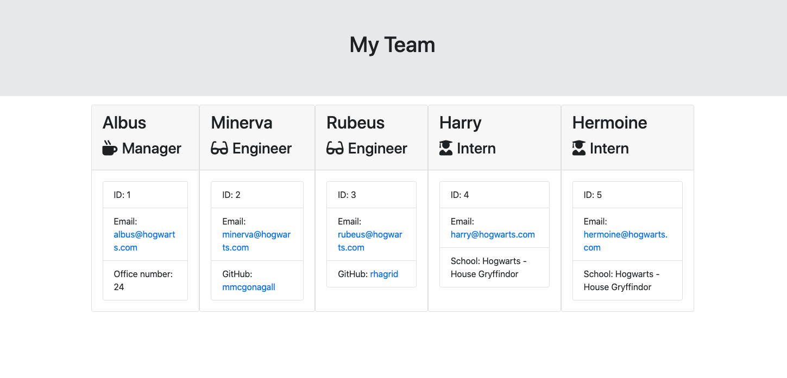

# Node Template Engine

## Description

A Node CLI application that generates a software engineering team directory. The inquirer package is used to gather user data then an HTML file is rendered in the output directory based on the user responses.

## Installation 

Run the command below to install the application dependencies:

```
npm install
```

## Usage

To launch the app run:

```
npm start
```

## Views

CLI Demo


Example Team Directory



## Tests

Jest is utilized to perform the tests for this application. It is listed as a developmental dependency so no additional installations are required.

In the command line enter:

```
npm run test
```


